<div align="center">
<picture>
  <source media="(prefers-color-scheme: dark)" srcset=".github/brand/banner-night.svg">
  
</picture>
<br><br>
<a href="#requirements"><picture><source media="(prefers-color-scheme: dark)" srcset=".github/brand/tab-requirements-night.svg"></picture></a>
<a href="#installation"><picture><source media="(prefers-color-scheme: dark)" srcset=".github/brand/tab-installation-night.svg"></picture></a>
<a href="#usage"><picture><source media="(prefers-color-scheme: dark)" srcset=".github/brand/tab-usage-night.svg"></picture></a>
<a href="#configuration"><picture><source media="(prefers-color-scheme: dark)" srcset=".github/brand/tab-configuration-night.svg"></picture></a>
<a href="#license"><picture><source media="(prefers-color-scheme: dark)" srcset=".github/brand/tab-license-night.svg"></picture></a>
</div>

<br>

Zarya.nvim provides an elegant floating UI for Apple Music inside Neovim — track info, playback controls, volume, and a Telescope-powered playlist picker, all without leaving your editor.

<p>
<a name="requirements"></a>
<picture><source media="(prefers-color-scheme: dark)" srcset=".github/brand/section-requirements-night.svg"></picture>
</p>

- Neovim 0.7+
- macOS (uses `osascript`)
- [telescope.nvim](https://github.com/nvim-telescope/telescope.nvim)
- [plenary.nvim](https://github.com/nvim-lua/plenary.nvim)

<p>
<a name="installation"></a>
<picture><source media="(prefers-color-scheme: dark)" srcset=".github/brand/section-installation-night.svg"></picture>
</p>

**lazy.nvim:**
```lua
{
  "NoamFav/Zarya.nvim",
  dependencies = {
    "nvim-telescope/telescope.nvim",
    "nvim-lua/plenary.nvim"
  },
  config = function()
    require("apple_music").setup({})
  end,
}
```

**packer.nvim:**
```lua
use {
  "NoamFav/Zarya.nvim",
  requires = { "nvim-telescope/telescope.nvim", "nvim-lua/plenary.nvim" },
  config = function() require("apple_music").setup() end
}
```

<p>
<a name="usage"></a>
<picture><source media="(prefers-color-scheme: dark)" srcset=".github/brand/section-usage-night.svg"></picture>
</p>

### Commands

| Command | Description |
|---------|-------------|
| `:MusicControl` | Open floating music control UI |
| `:FocusMusicUI` | Focus / unfocus the floating window |
| `:MusicPickPlaylist` | Telescope playlist picker |

### Default Key Mappings

| Mapping | Action |
|---------|--------|
| `<Leader>mu` | Open Music UI |
| `<Leader>mp` | Play / Pause |
| `<Leader>mn` | Next track |
| `<Leader>mb` | Previous track |
| `<Leader>m+` | Volume up |
| `<Leader>m-` | Volume down |
| `<Leader>mq` | Close UI |
| `<Leader>mm` | Focus UI |
| `<Leader>pp` | Pick playlist |

<p>
<a name="configuration"></a>
<picture><source media="(prefers-color-scheme: dark)" srcset=".github/brand/section-configuration-night.svg"></picture>
</p>

The UI refreshes every 2 seconds by default — adjustable in the setup options.

<p>
<a name="license"></a>
<picture><source media="(prefers-color-scheme: dark)" srcset=".github/brand/section-license-night.svg"></picture>
</p>

Apache 2.0 — see [LICENSE](LICENSE).

<div align="center">
Made with ❤️ by <a href="https://github.com/NoamFav">NoamFav</a>
</div>

<br>

<a href="https://nf-software.com">
<picture>
  <source media="(prefers-color-scheme: dark)" srcset=".github/brand/footer-night.svg">
  
</picture>
</a>
